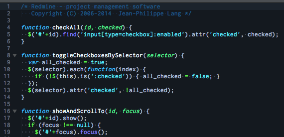
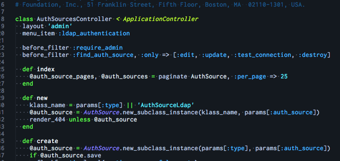

#DeepSea

##Sublime Text Color Scheme

Deep, Blue, Simple SublimeText 2/3 Color Scheme.


###Samples

###Javascript


###ruby



##Installation

Copy <strong>DeepSea.tmTheme</strong> to...


```
~/Library/Application Support/Sublime Text 3/Packages
```

##LISENSE

MIT
